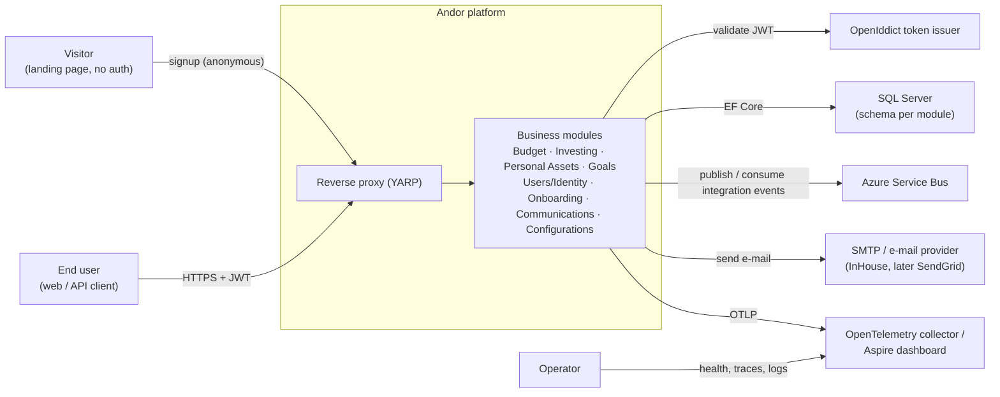

# 3. Context & Scope

## 3.1 Business context

Andor sits between the people who use it and a small number of infrastructure partners.

### External entities

| Entity | Direction | Interface | Purpose |
|---|---|---|---|
| **End user** | in | HTTPS REST, `/v{version}/…`, `Authorization: Bearer <jwt>` | All authenticated business operations. |
| **Visitor** | in | HTTPS REST, `POST /v{version}/onboarding/start` \| `/verify`, no token | Public signup — the only anonymous surface. |
| **Operator** | in/out | `/health`, `/alive`, OTLP telemetry | Liveness/readiness and observability. |
| **OpenIddict token issuer** | in | JWT validation (issuer, audience, signing key) | Every business service authenticates requests the same way. |
| **SQL Server** | out | EF Core 10 provider | Persistence; one schema/database per module. |
| **Azure Service Bus** | out/in | `IMessageSenderInterface` (send), `BackgroundService` consumers (receive), queue `request-communication` + topic subscriptions | Asynchronous integration between modules and out to Communications. |
| **SMTP / e-mail provider** | out | `InHousePartner` (SMTP today); `Partner` enum reserves `SendGrid` | Actual delivery of notification e-mails. |
| **OpenTelemetry backend** | out | OTLP exporter (enabled when `OTEL_EXPORTER_OTLP_ENDPOINT` is set); Aspire dashboard locally | Traces, metrics and logs. |
| **Container registry / runtime** | out | OCI images (`adait.azurecr.io/<service>`), Kubernetes/Azure Web App | Deployment target. |

## 3.2 Technical context

| Concern | Choice |
|---|---|
| **Ingress** | A single YARP reverse-proxy project maps a path prefix per module (`/accounts`, `/assets`, `/users`, `/communications`, `/onboarding`, `/configurations`) onto the corresponding service and strips the prefix. Service-to-service addresses use Aspire service discovery (`https+http://accounts-api`, …). |
| **North–south protocol** | HTTPS/JSON REST. Envelope is always `DefaultResponse<T>` with `TraceId` from `Activity.Current`. |
| **East–west protocol** | Integration events as JSON messages on Azure Service Bus. Producers write to the transactional **Outbox**; a shared dispatcher relays them. Consumers are per-service `BackgroundService`s that complete/abandon messages for retry + dead-lettering. |
| **In-process messaging** | Within a service, aggregate commands are Akka.NET messages (`ICommands<TId>`) routed `ManagerActor → Actor`. |
| **Persistence** | EF Core 10 → SQL Server. Each module has its own `DbContext` and schema (`Communication.*`, `Accounts.*`, …). Migrations are applied on service start (`app.Apply<Module>MigrationsAsync()`). |
| **AuthN/Z** | JWT Bearer validated in every service; `ICurrentUserService` exposes the acting user; `IAuthorizationService` + `Permissions` gate operations. |
| **Config** | `appsettings.json` + environment. Notable keys: `ServiceBus:*`, `ApplicationSettings:SmtpConfig` (with `EmailTest` override), `Tenants` (per-schema connection strings), `OTEL_EXPORTER_OTLP_ENDPOINT`. |

## 3.3 Scope

**In scope:** the eight backend modules above, their REST APIs, the reverse proxy, the messaging
fabric, local Aspire orchestration, the container image, CI + quality gates, and this
documentation.

**Out of scope:** a first-party web/mobile UI (clients are external), the token-issuing IdP
deployment itself, the mail provider, and any BI/reporting layer.
