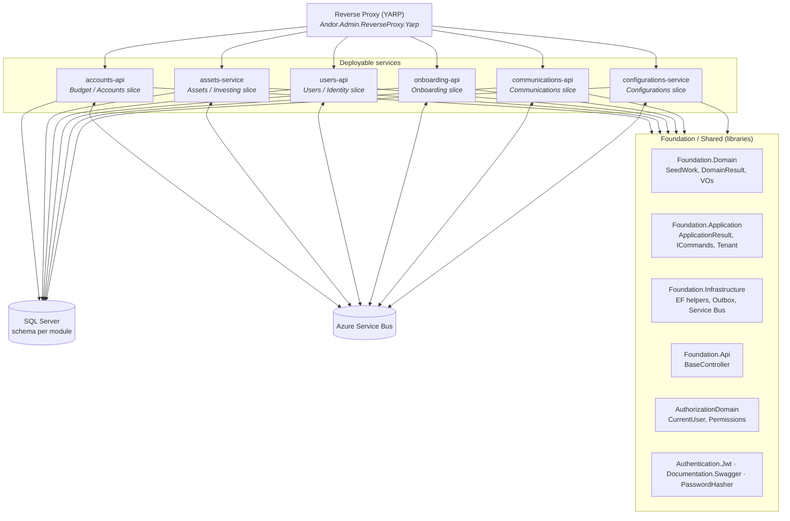
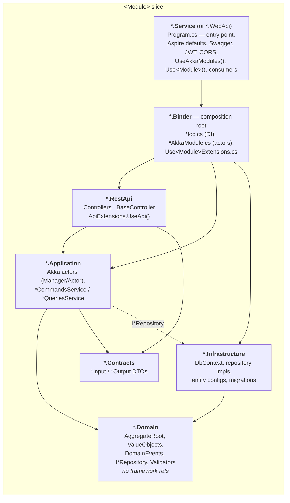
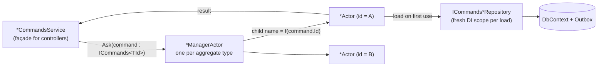
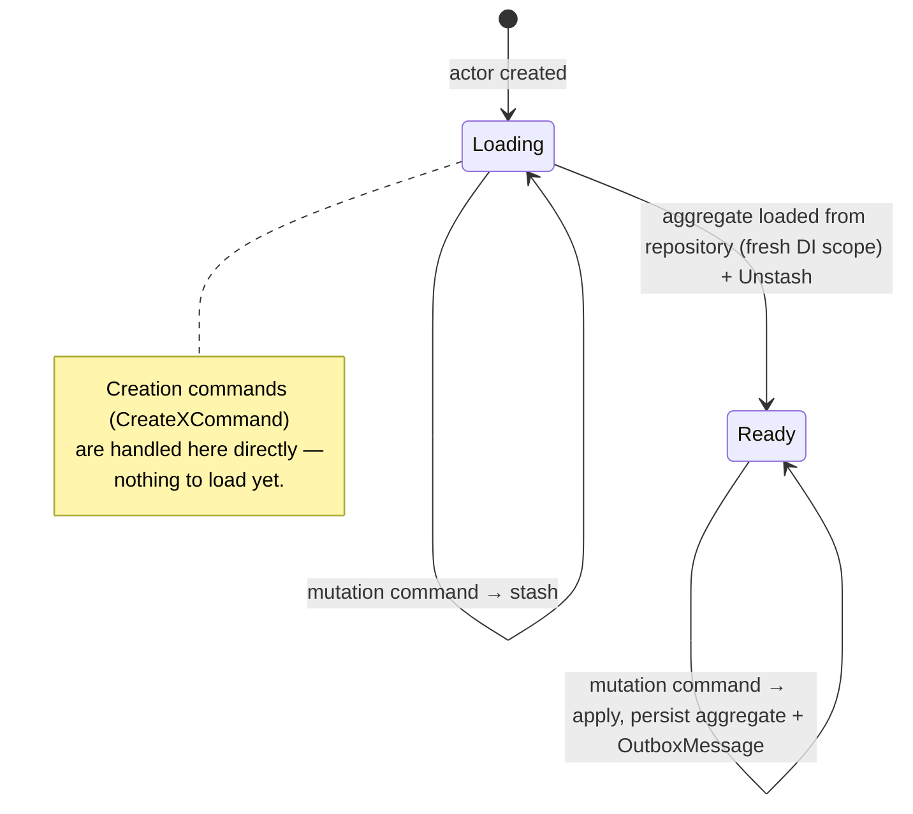

# 5. Building Block View

## 5.1 Level 1 — the system as modules

Andor is one modular monolith. Business capabilities are **vertical slices**; a handful of
**deployable services** each host one or more slices; a **reverse proxy** is the single ingress;
**Foundation/Shared** libraries are used by every slice.

### Contained building blocks

| Building block | Responsibility | Notes |
|---|---|---|
| **Reverse Proxy** | Single entry point; path-prefix routing to each service; CORS. | `PathRemovePrefix` transform; destinations via Aspire service discovery. |
| **Budget / Accounts slice** (`accounts-api`) | Current accounts, financial movements, categories, budgets, invites, cash-flow projections, currencies. | Also hosts a `/ws` WebSocket for push and several Service Bus consumers (`UserVerifiedConsumer`, `AccountCreatedConsumer`, `CashFlowProjectionConsumer`). |
| **Assets / Investing slice** (`assets-service`) | Investment assets & positions, FIFO cost calculation. | |
| **Users / Identity slice** (`users-api`) | User records and identity data. | Consumes `SignupVerifiedDomainEvent`. |
| **Onboarding slice** (`onboarding-api`) | Public signup: `start` (code) and `verify` (password). Only `[AllowAnonymous]` surface. | Emits `SignupCodeGenerated`, `SignupVerifiedDomainEvent`. |
| **Communications slice** (`communications-api`) | Renders and sends outbound notifications from `Rule` + `Template`. | Consumes queue `request-communication`; SMTP via `InHousePartner`. |
| **Configurations slice** (`configurations-service`) | Cross-cutting runtime configuration. | |
| **Foundation / Shared** | Base types, Result pattern, EF/Outbox/Service Bus helpers, `BaseController`, JWT, Swagger, password hashing, authorization. | No slice-specific code; every slice references it. |

Per-domain models and rules: [Budget](../budget.md) · [Investing](../investing.md) ·
[Personal Assets](../personal-assets.md) · [Goals](../goals.md) · [Onboarding](../onboarding.md) ·
[Communications](../communications.md).

## 5.2 Level 2 — inside a vertical slice

Every slice is the **same seven projects**. This uniformity is deliberate: it makes any module
navigable once you have learned one, and lets CI treat modules interchangeably.

| Project | Contains | Depends on |
|---|---|---|
| `*.Domain` | Aggregates, entities, value objects, domain events, `ICommands*Repository` interfaces, validators, `*DomainErrorCode`. | `Foundation.Domain` only. |
| `*.Application` | `*ManagerActor` / `*Actor`, command handlers, `*CommandsService` / `*QueriesService` + interfaces. | `*.Domain`, `*.Contracts`, `Foundation.Application`, `AuthorizationDomain`. |
| `*.Contracts` | `*Input` / `*Output` DTOs at the REST boundary; independent of `Domain` types. | `Foundation.Contracts`. |
| `*.Infrastructure` | `DbContext`, repository implementations, `IEntityTypeConfiguration`s, EF migrations, outbox context provider. | `*.Domain`, `Foundation.Infrastructure`. |
| `*.Binder` | `*Ioc.cs` (DI registration), `*AkkaModule.cs` (actor wiring), one `Use<Module>Extensions.cs`. | `*.Application`, `*.Infrastructure`, `*.RestApi`. |
| `*.RestApi` | ASP.NET controllers extending `BaseController`; `ApiExtensions.UseApi()` registers the assembly part. | `*.Application`, `*.Contracts`, `Foundation.Api`. |
| `*.Service` / `*.WebApi` | `Program.cs`: `AddServiceDefaults()`, Swagger, JWT, CORS, `UseAkkaModules("<System>")`, `builder.Use<Module>(...)`, hosted consumers, migrations on start. | `*.Binder`, `ServiceDefaults`, `Authentication.Jwt`. |

### Dependency rules

- Dependencies point **inward**: `Service → Binder → {RestApi, Application, Infrastructure} → Domain`.
- `Application` knows repository **interfaces**; `Infrastructure` provides the implementations, wired in `Binder`.
- No slice references another slice's `Domain`, `Application` or `Infrastructure`. Cross-slice communication is events (Service Bus) or a published `Contracts` type.

## 5.3 Level 3 — the actor write model inside `*.Application`

Command-side writes never touch a repository directly from a service. They go through a two-actor
pattern per aggregate type.

**`*ManagerActor`** — receives any `ICommands<TId>`, derives a child actor name from the
aggregate id, forwards the command, creating the child on first use (`Context.Child` /
`Context.ActorOf`).

**`*Actor`** — owns one aggregate instance's lifecycle as a state machine (`Become` +
`IWithUnboundedStash`):

New aggregate commands follow this **Manager → Actor → Stash** shape rather than calling the
repository from the application service. See [ADR-0002](adr/0002-actor-model-for-writes.md).

## 5.4 Foundation building blocks (reference)

| Block | Key types |
|---|---|
| `Foundation.Domain` | `Entity<TId>`, `AggregateRoot<TId>` (raises `DomainEvent` into `Events`), `ICommandRepository<TEntity,TId>`, `DomainResult`, `Notification`, value objects (`Name`, `Description`, `Month`, `Year`, `StringValueObject`), `Enumeration`. |
| `Foundation.Application` | `ApplicationResult<T>` (implicit convert from `T`, accumulates errors/warnings/infos), `ICommands<TId>`, `ITenantService` / `TenantService`, `SearchInput` / `SearchOutput`. |
| `Foundation.Contracts` | `ErrorModel`, `DefaultResponse<T>`, `PaginatedListOutput`. |
| `Foundation.Api` | `BaseController.Result<T>(ApplicationResult<T>)` → `200/204/400/404/500` with `DefaultResponse<T>` + `TraceId`. |
| `Foundation.Infrastructure` | `GlobalQueryExtensions`, `TenantDbContextExtensions`, `QueryHelper`; **Outbox** (`OutboxDispatcher`, `IOutboxContextProvider`, `OutboxMessage`); **Service Bus** (`ServiceBusIoc.WithAzureServiceBusMessaging`, `IMessageSenderInterface`). |
| `Foundation.ServerServices` | `GlobalExceptionHandlerMiddleware`, CORS, JSON provider. |
| `ServiceDefaults` | `AddServiceDefaults()` — OpenTelemetry, `/health` + `/alive`, service discovery, standard HTTP resilience. |
| `AuthorizationDomain` | `ICurrentUserService` / `CurrentUserService`, `IAuthorizationService`, `Permissions`, license types. |
