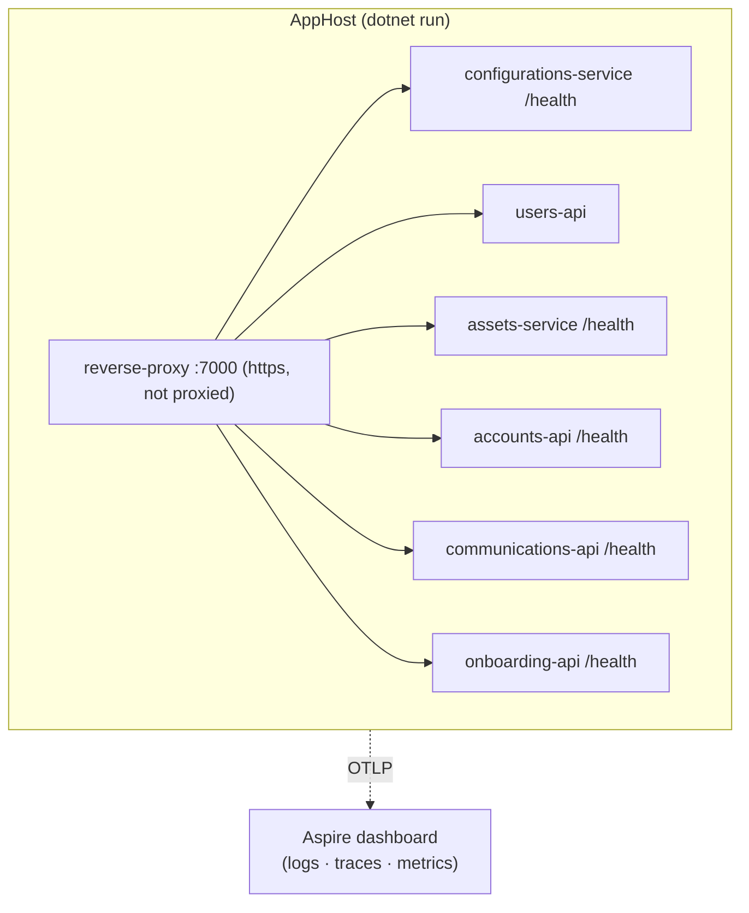
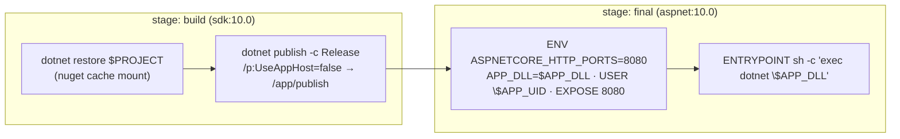
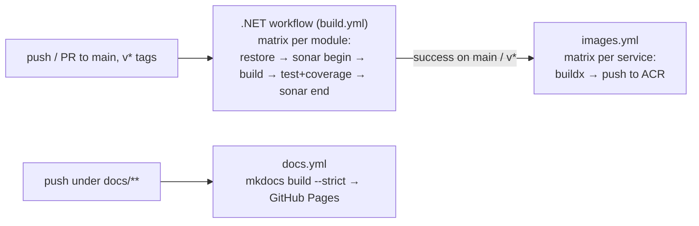

# 7. Deployment View

## 7.1 Local — .NET Aspire

`Andor.AppHost` (`Src/Administrations/Aspire/Andor.AppHost/AppHost.cs`) is the single source of
truth for the local topology.



- One command: `dotnet run --project Src/Administrations/Aspire/Andor.AppHost/Andor.AppHost.csproj`.
- The proxy has a **fixed** endpoint on port **7000** (`IsProxied = false`); it `WithReference`s and `WaitFor`s every service.
- Each business service has an HTTP health check at `/health`; `users-api` currently has none registered in the AppHost.
- Telemetry flows to the Aspire dashboard via OTLP (`OTEL_EXPORTER_OTLP_ENDPOINT` injected by Aspire).
- Supporting infrastructure (SQL Server, Service Bus emulator/namespace) is supplied by the developer environment / configuration; the devcontainer adds PostgreSQL and Prometheus features for experimentation.

## 7.2 Build & image

One `Dockerfile` builds **every** deployable service; the service is selected by build args.



```bash
docker build \
  --build-arg PROJECT=Src/Budget/Andor.Accounts.Service/Andor.Accounts.Service.csproj \
  --build-arg APP_DLL=Andor.Accounts.Service.dll \
  -t adait.azurecr.io/accounts-api .
```

| Property | Value |
|---|---|
| Base images | `mcr.microsoft.com/dotnet/sdk:10.0` (build), `mcr.microsoft.com/dotnet/aspnet:10.0` (runtime) |
| Listens on | `8080`, plain HTTP — **TLS terminated by the ingress** |
| Runs as | non-root (`$APP_UID`) |
| Registry | `adait.azurecr.io/<service>` |
| Tags | `sha-<commit>`, `latest` (main), `{{version}}` (on `v*` tags) |

## 7.3 CI/CD pipeline



| Workflow | Trigger | Output |
|---|---|---|
| `.github/workflows/build.yml` | push/PR to `main`, `v*` tags | Per-module build + tests + coverage, analysed by SonarCloud project `adas-it_andor-<module>`. No aggregate job. |
| `.github/workflows/images.yml` | after a green `.NET` run on `main`; `v*` tags; manual | One image per service pushed to ACR with buildx GHA cache. |
| `.github/workflows/docs.yml` | changes under `docs/**` | MkDocs Material site → GitHub Pages (`https://adas-it.github.io/andor/`). |
| `.github/workflows/cd.yaml` | after a green run | Legacy path — Docker Hub image + Kustomize image bump + Azure Web App deploy. |

## 7.4 Runtime target

| Artifact | Target |
|---|---|
| Service images | Azure Container Registry → Kubernetes (`k8s/`, Kustomize: `namespace` `prod`, `Deployment`, `Service`) and/or Azure Web App for Containers (`cd.yaml`). |
| TLS | Platform ingress / gateway; services speak plain HTTP on `8080`. |
| Configuration | Environment + `appsettings.{Environment}.json`: `ServiceBus:*`, `ApplicationSettings:SmtpConfig` (`EmailTest` to redirect all mail), `Tenants` connection strings, `OTEL_EXPORTER_OTLP_ENDPOINT`. |
| Database | SQL Server; migrations applied by each service on startup (`app.Apply<Module>MigrationsAsync()`), plus seed steps (e.g. default currency, seeded communication rules). |

!!! warning "Deployment inconsistencies"
    `k8s/` manifests still describe a single `andor-familybudget` container on port 80/5000 and a
    Docker Hub image, which predates the per-service ACR model in `images.yml`. `cd.yaml`
    references a workflow name (`"CI build"`) that does not match `build.yml`'s `name:` (`.NET`),
    so it never triggers. See [chapter 11](11-risks-and-technical-debt.md).
