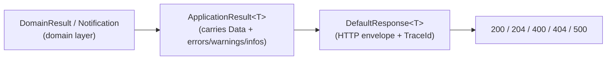
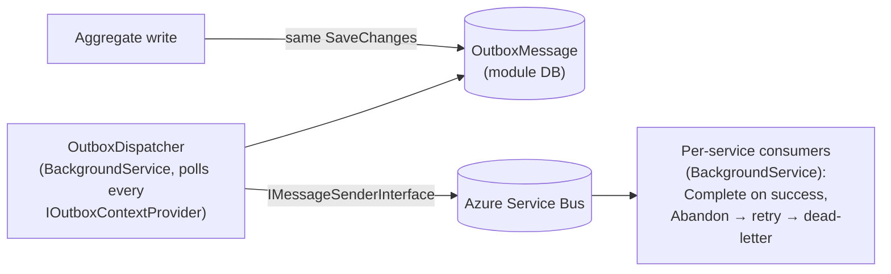

# 8. Cross-cutting Concepts

Concepts that apply across modules. Each is implemented once (usually in `Foundation.*`) and
reused by every slice.

## 8.1 Domain model & DDD tactical patterns

- **Aggregate root** (`AggregateRoot<TId>` in `Foundation.Domain.SeedWork`) is the only entry
  point for a consistency boundary. It raises `DomainEvent`s into an in-memory `Events`
  collection; infrastructure turns those into `OutboxMessage`s.
- **Value objects** — `Name`, `Description`, `Month`, `Year`, `Iso`, strongly-typed ids
  (`AccountId`, `RuleId`, …) built on `StringValueObject` / `Enumeration`. Construction validates;
  invalid values cannot exist.
- **Repository interfaces** (`ICommands*Repository : ICommandRepository<TEntity,TId>`) live in
  `*.Domain`; implementations live in `*.Infrastructure`. The domain never sees EF Core.
- **Validators** (`I*Validator`) are injected so tests can supply a mock and exercise one rule at
  a time.

## 8.2 Result / Notification pattern (no exceptions for expected failures)

- A domain operation returns `DomainResult`; it never throws for a business rule violation.
- The application layer wraps outcomes in `ApplicationResult<T>` (implicit conversion from `T`,
  accumulates `errors` / `warnings` / `infos`).
- `BaseController.Result<T>(ApplicationResult<T>)` is the **only** place status codes are chosen.
  Every response is a `DefaultResponse<T>` with the current `Activity` `TraceId`.
- Exceptions are reserved for the genuinely unexpected and are caught by
  `GlobalExceptionHandlerMiddleware` → `500`.

Rationale: [ADR-0004](adr/0004-result-pattern-over-exceptions.md).

## 8.3 Command handling with actors

- Aggregate writes go `*CommandsService` → `Ask` `*ManagerActor` → `*Actor`.
- `*ManagerActor` routes by aggregate id (child actor name derived from the id), creating the
  child on demand.
- `*Actor` is a `Become`/`IWithUnboundedStash` state machine: `Loading` (stash mutations,
  self-send preload, load from repository in a fresh DI scope) → `Ready` (unstash, serve).
- Creation commands are handled in `Loading`; mutations only in `Ready`.
- One actor per aggregate instance ⇒ **serialized writes** per aggregate, no distributed locking.
- Each module starts its own `ActorSystem` via `builder.UseAkkaModules("<SystemName>")` and a
  `*Binder/Application/ApplicationAkkaModule.cs : IAkkaModule`.

Rationale: [ADR-0002](adr/0002-actor-model-for-writes.md).

## 8.4 Messaging — Outbox + Service Bus

- Producers **never** call Service Bus inline. They persist an `OutboxMessage` transactionally
  with the aggregate (see `CommunicationOutboxContextProvider` for the per-module wiring).
- The shared `OutboxDispatcher` is module-agnostic: it discovers every registered
  `IOutboxContextProvider` and relays pending messages.
- Consumers are idempotent and use explicit `Complete`/`Abandon` so Service Bus owns retry and
  dead-lettering.
- Transport is abstracted behind `IMessageSenderInterface`
  (`ServiceBusIoc.WithAzureServiceBusMessaging`).

Rationale: [ADR-0003](adr/0003-transactional-outbox.md).

## 8.5 Persistence & multi-tenancy

- One `DbContext` and one schema per module (`Accounts.*`, `Communication.*`, …);
  [ADR-0005](adr/0005-schema-per-module-persistence.md).
- `Foundation.Infrastructure` supplies `GlobalQueryExtensions` / `TenantDbContextExtensions` /
  `QueryHelper`: tenant scoping is applied as an EF Core **global query filter**, so a missing
  `WHERE tenant = …` cannot leak rows.
- `ITenantService` / `TenantService` (`Foundation.Application`) resolves the active tenant;
  `Tenants` configuration holds the per-tenant connection string(s).
- Migrations are applied on service start; deterministic seed data ships as `InsertData`
  migrations (fixed GUIDs, fixed timestamps).

## 8.6 Security

- **AuthN:** JWT Bearer, configured identically in every service via
  `builder.Services.ConfigureJwt(...)` (`Andor.Authentication.Jwt`) + OpenIddict validation.
- **Anonymous surface:** only Onboarding's `start` / `verify`.
- **AuthZ:** `ICurrentUserService` exposes the acting user (controllers do not read
  `HttpContext` directly); `IAuthorizationService` + `Permissions` + license types
  (`AuthorizationDomain`) gate operations.
- **Secrets / passwords:** `Foundation.PasswordHasher` (shared) hashes in the application layer
  **before** the value reaches the domain or any event. Plain-text passwords are never persisted
  or transmitted onward.
- **Transport:** services assume TLS is terminated upstream; `UseHttpsRedirection()` locally.
- **CORS:** centralised (`AddFoundationCors` / `UseFoundationCors`), allowed origins from config.

## 8.7 Observability & operability

- `AddServiceDefaults()` (`ServiceDefaults`) wires, for every service:
  - OpenTelemetry **traces** (ASP.NET Core + HttpClient sources; health-check requests filtered
    out), **metrics** (ASP.NET Core, HttpClient, runtime), and **logs** (formatted messages +
    scopes). Exported via OTLP when `OTEL_EXPORTER_OTLP_ENDPOINT` is set.
  - Health checks: `/health` (all checks) and `/alive` (checks tagged `live`) — mapped only in
    Development by default.
  - **Service discovery** and a **standard HTTP resilience** handler on all `HttpClient`s.
- `TraceId` is surfaced in every HTTP response envelope, linking a client-visible error to a
  trace.

## 8.8 API design

- REST, versioned (`Asp.Versioning`), routes `/{module}/v{version}/…` after the proxy strips the
  module prefix.
- Uniform envelope `DefaultResponse<T>` (`data`, `errors`, `traceId`); pagination via
  `PaginatedListOutput` / `SearchInput` / `SearchOutput`.
- Swagger per service (`AddSwagger` / `UseCustomSwagger`) driven by the version description
  provider.
- Controllers are thin: map `*Input` → command/query, call the service, return
  `BaseController.Result(...)`.

## 8.9 Configuration management

- Central Package Management (`Directory.Packages.props`) — one pinned version per package.
- `Directory.Build.props` — `net10.0`, `Nullable`, `ImplicitUsings` for every project.
- Runtime config from `appsettings*.json` + environment; no secrets in source.

## 8.10 Testing strategy

| Level | Where | How |
|---|---|---|
| Domain unit tests | `Tests/<Area>/<Module>.Domain.Tests` | xUnit + Moq; a static `*Fixture` builds valid aggregates via `Aggregate.NewAsync(...)` with a mock validator; **one behaviour per file**. |
| Infrastructure tests | `Tests/<Area>/<Module>.Infrastructure.Tests` | Repository/EF mappings. |
| Component tests | `Tests/<Area>/<Module>.ComponentTests` | `WebApplicationFactory`-style, exercising the API surface of a service. |
| Quality gate | SonarCloud, per module | Coverage collected with `dotnet-coverage`, reliability/security/duplication gated. |
