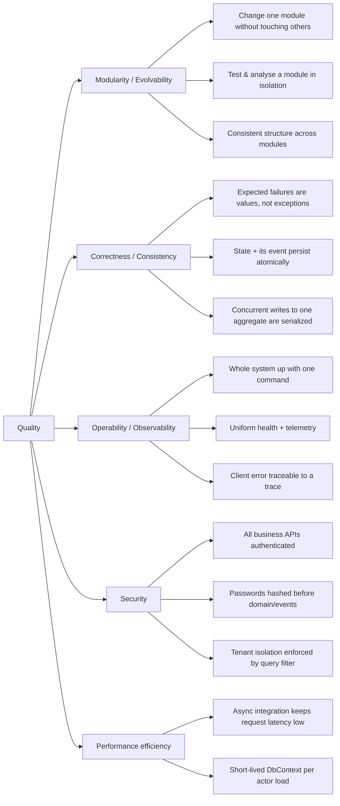

# 10. Quality Requirements

## 10.1 Quality tree

## 10.2 Quality scenarios

Format: *stimulus → expected response*. These are the concrete, checkable version of the goals in
[chapter 1](01-introduction-and-goals.md).

### Modularity / Evolvability

| ID | Scenario | Response |
|---|---|---|
| QS-M1 | A developer adds a field + rule to the Accounts domain. | Only `Andor.Accounts.*` projects and `Tests/Budget/Andor.Accounts.*` change; `dotnet build` of the Accounts service and its tests passes without rebuilding other modules. |
| QS-M2 | CI runs for a PR touching one module. | The `build.yml` matrix leg for that module builds, tests and Sonar-analyses it independently; other legs are unaffected. |
| QS-M3 | A developer opens a module they have never seen. | They find `Domain / Application / Contracts / Infrastructure / Binder / RestApi / Service` in the same layout as every other module. |
| QS-M4 | Someone references another module's `Domain` project. | It stands out immediately as an illegal dependency in review (only `Contracts` + events are allowed across slices). |

### Correctness / Consistency

| ID | Scenario | Response |
|---|---|---|
| QS-C1 | A command violates a domain rule (e.g. duplicate category). | Response is `400` `DefaultResponse` with a `DomainErrorCode` and `TraceId`; **no** rows written; no exception in logs. |
| QS-C2 | The process crashes immediately after an aggregate write, before the event is sent. | On restart, the `OutboxMessage` is still pending and `OutboxDispatcher` relays it — the event is not lost. |
| QS-C3 | Two commands for the same aggregate id arrive concurrently. | They are processed sequentially by that aggregate's single actor; the second sees the first's result. No optimistic-concurrency exception. |
| QS-C4 | A consumer receives the same integration event twice. | The second delivery is a no-op (idempotent consumer); no duplicate user/account created. |
| QS-C5 | Communications gets a request whose `Title`+`ContentLanguage` matches no template. | `RuleNotFound (5001)`; message is abandoned and retried, then dead-lettered; no partial send. |

### Operability / Observability

| ID | Scenario | Response |
|---|---|---|
| QS-O1 | A new contributor clones the repo and runs the AppHost. | One command brings up all six services + proxy; the Aspire dashboard shows each as healthy. |
| QS-O2 | A user reports an error and quotes the `traceId` from the response. | The operator finds the full distributed trace for that request (health-check noise excluded). |
| QS-O3 | An orchestrator probes a service. | `/alive` reflects liveness; `/health` reflects readiness (all checks). |
| QS-O4 | A single module has a regression on `main`. | Only that module's image needs rebuilding/rolling; `images.yml` builds per service. |

### Security

| ID | Scenario | Response |
|---|---|---|
| QS-S1 | A request without a valid JWT hits any business endpoint. | `401`; only `/onboarding/start` and `/onboarding/verify` are reachable anonymously. |
| QS-S2 | A signup completes. | The password exists only as a hash by the time it leaves the application layer; no plain-text password in DB, logs or events. |
| QS-S3 | A query omits an explicit tenant filter. | The global query filter still scopes results to the active tenant. |

### Performance efficiency

| ID | Scenario | Response |
|---|---|---|
| QS-P1 | A module needs another module to react to a change. | It writes an event and returns; the caller's request latency does not include the downstream work. |
| QS-P2 | An actor handles a burst of commands for one aggregate. | The aggregate is loaded once into the actor; each command uses a short-lived `DbContext` scope only to persist. |

## 10.3 Not (yet) addressed

Explicitly **out of scope** for the current design — see
[chapter 11](11-risks-and-technical-debt.md):

- Per-capability horizontal scaling and load/latency SLOs under stress.
- Actor persistence / clustering (actors are single-node, in-memory, reload-on-demand).
- Formal availability targets and DR/backup runbooks.
- Penetration testing and a documented threat model.
